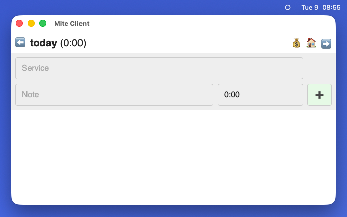
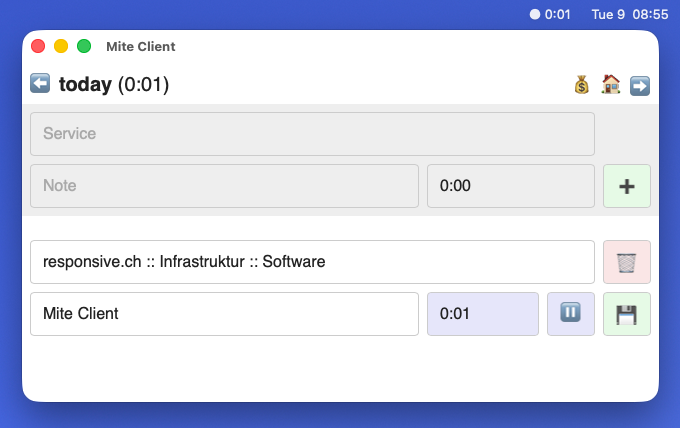
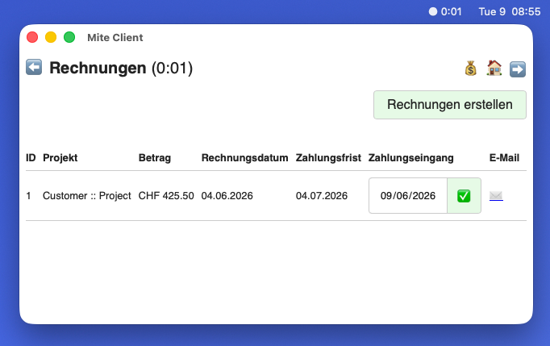
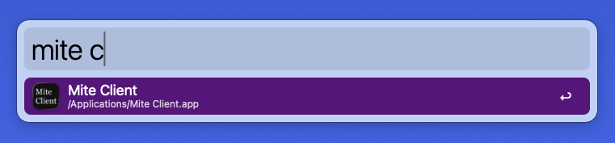
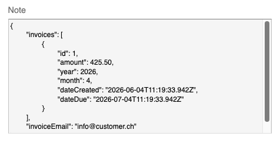

# Mite Client

Custom UI for [mite](https://mite.de) to simplify my transition from the [soon-to-be-enshittified](https://www.reddit.com/r/HarvestApp/comments/1q25xpy/purchase_by_bending_spoons/) [Harvest](https://www.getharvest.com).

I use it as an alternative to [mite.nano](https://mite.de/blog/2021/10/13/mite-nano-app-macos/) because it is missing the possibility to add notes when creating entries. It additionally adds a basic inviocing functionality.

Features:

- Minimal time tracking UI:
  
  
- One-click PDF invoice generation with payment history:
  
- [Tauri](https://tauri.app) wrapper to use as menubar app:
  
  

## Packages

- [`packages/client`](./packages/client): Client application running on Node.js, using [Puppeteer](https://pptr.dev) for PDF generation, password-protected using basic authentication
- [`packages/tauri`](./packages/tauri): Tauri menubar app rendering client application in iframe

## Notes

- Expects Mite service names to use the following pattern: `Customer Name :: Project Name :: Service Name`. This allos me to have project-specific services rather than being able to use the same service in multiple projects.
- Persists project invoice data as stringified JSON to a project's `note` field:
  
