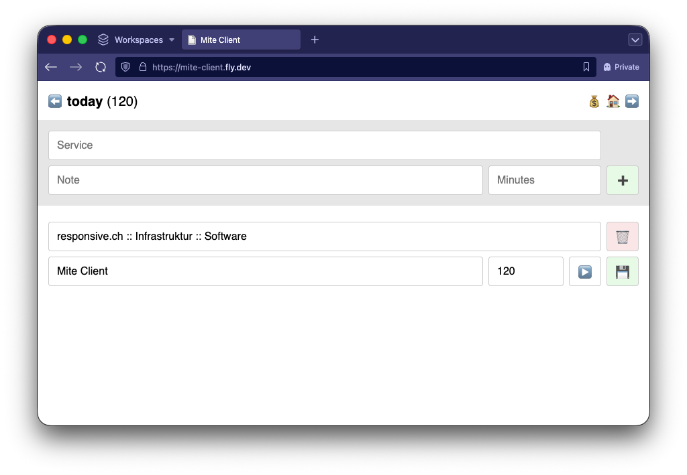

# Mite Client

Custom UI for [mite](https://mite.de) to simplify my transition from the [soon-to-be-enshittified](https://www.reddit.com/r/HarvestApp/comments/1q25xpy/purchase_by_bending_spoons/) [Harvest](https://www.getharvest.com).

I use it as an alternative to [mite.nano](https://mite.de/blog/2021/10/13/mite-nano-app-macos/) because it is missing the possibility to add notes when creating entries. It additionally adds a basic inviocing functionality.

Features:

- Minimal time tracking UI.
- [Server-sent event](https://developer.mozilla.org/en-US/docs/Web/API/Server-sent_events/Using_server-sent_events) endpoint for current timer.
- One-click PDF invoice generation using [Puppeteer](https://pptr.dev).
- Invoice data persistence in project `note` field.
- [Tauri](https://tauri.app) wrapper to use as menubar app.

## Packages

- [`packages/client`](./packages/client): Client application
- [`packages/tauri`](./packages/tauri): Tauri menubar app

## Notes

- Expects Mite service names to use the following pattern: `Customer Name :: Project Name :: Service Name`
- Persists project invoice data as stringified JSON to a project's `note` field
